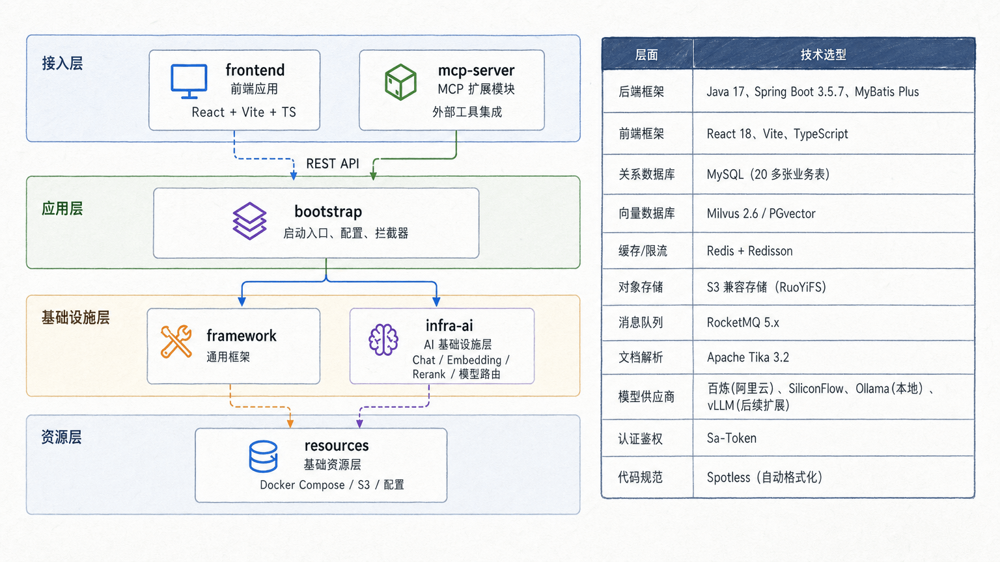
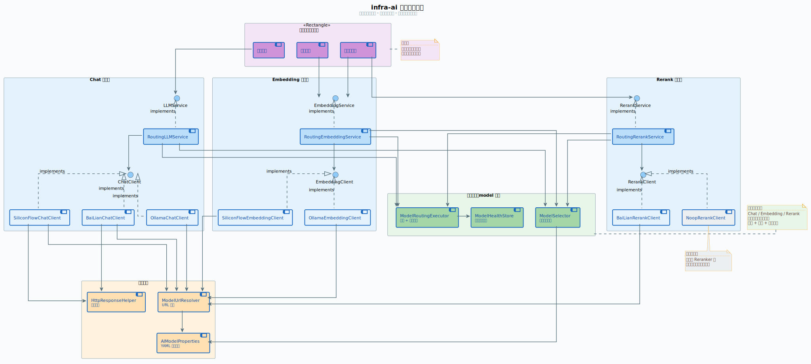
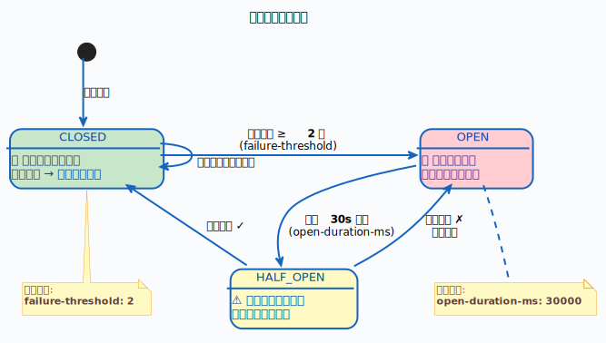

<p align="center">
  <a href="https://github.com/cz1015/cz">
    
  </a>
</p>

<h1 align="center">Ragent AI</h1>

<p align="center">
  企业级 Agentic RAG 知识库与智能问答平台
</p>

<p align="center">
  
  
  
  
  <a href="./LICENSE"></a>
</p>

> 维护者：**cz**
>
> 本仓库基于 [nageoffer/ragent](https://github.com/nageoffer/ragent) 进行二次开发，重点增强会话记忆、长期记忆、Prompt 上下文编排、用户级资源隔离、受保护 MCP 调用和可复现的业务评测能力。

## 项目概览

Ragent AI 是一个前后端分离的 Agentic RAG 平台，覆盖文档入库、知识检索、意图识别、MCP 工具调用、模型路由、流式问答、会话记忆和链路追踪等完整流程。

系统后端采用 Java 17 和 Spring Boot 3.5.7，按通用框架、AI 基础设施、业务服务和 MCP Server 拆分为多个 Maven 模块；前端使用 React 18、TypeScript 和 Vite 构建用户问答界面及管理控制台。

## 核心能力

| 能力 | 说明 |
| --- | --- |
| 知识库管理 | 支持知识库、数据集、文档和分块管理，记录文档处理状态及执行日志 |
| 文档入库 Pipeline | 通过可编排节点完成解析、切分、向量化和持久化，支持节点级日志与失败定位 |
| 多路检索 | 支持全局向量检索、意图定向检索及后处理链，兼顾召回率与结果精度 |
| 意图识别 | 使用树形意图结构完成多级分类，对低置信度结果进行歧义引导 |
| 问题处理 | 支持问题重写、子问题拆分和多意图解析，为后续检索提供结构化输入 |
| MCP 集成 | 根据意图提取参数并调用 MCP 工具，可与知识库检索结果组合生成答案 |
| 权限控制 | 支持全局/个人知识库隔离、检索前权限裁剪、MCP 工具授权和远端服务行级数据过滤 |
| 模型路由 | 支持多模型候选、优先级调度、健康检查、三态熔断和自动降级 |
| 会话记忆 | 支持近期对话窗口、会话摘要和结构化长期记忆，控制上下文长度 |
| 流式输出 | 基于 SSE 返回模型响应，支持首包探测、取消请求和模型切换 |
| 可观测性 | 记录 RAG 全链路 Trace、节点耗时、输入输出及异常信息 |
| 业务评测 | 支持从同步 Chat 决策入口评测意图、MCP 执行、语义正确性、越权、延迟和吞吐量 |
| 管理控制台 | 提供知识库、意图树、模型、入库任务、链路追踪、用户和系统设置页面 |

## 我的二次开发改进

本项目保留上游 Ragent 的文档入库、意图识别、多路检索、MCP 调用和流式问答能力，我主要围绕 Agent Harness 中的**记忆与上下文层**、**权限控制层**和**运行评测层**做了三组可独立验证的增强。

### 1. 结构化长期记忆与上下文编排

#### 业务场景

原项目的消息记录和会话摘要只能解决单次会话内的上下文连续性。用户开启新会话后，技术偏好、持续维护的项目、长期约束等信息仍需重复说明。为此增加跨会话的结构化长期记忆，使系统能够在后续问题中恢复与当前用户相关的稳定背景，同时避免把完整历史对话持续塞入 Prompt。

长期记忆分为四类：

| 类型 | 用途 | 示例 |
| --- | --- | --- |
| `PREFERENCE` | 用户长期偏好 | 偏好 Java/Spring 风格的实现 |
| `PROJECT` | 持续项目背景 | 正在二次开发 RAG 智能应用 |
| `CONSTRAINT` | 长期规则和边界 | 不修改现有接口协议 |
| `FACT` | 用户明确提供且可复用的事实 | 当前项目使用 PostgreSQL |

#### Harness Engineering 维度

- **记忆与上下文层**：区分会话原始消息、会话摘要和跨会话长期记忆，控制每类上下文的生命周期。
- **Prompt 编排层**：按稳定性组织 Stable、Semi-stable、History、Ephemeral 四层上下文。
- **运行与可靠性层**：记忆抽取异步执行，抽取或召回失败时降级为空上下文，不阻塞 SSE 主链路。

#### 技术实现

长期记忆形成完整的抽取、合并、召回和注入闭环：

```text
助手回答完成并持久化
  -> 异步读取当前用户近期 user/assistant 消息
  -> LLM 按固定 JSON Schema 抽取候选记忆
  -> 校验类型、记忆键、内容、置信度和重要度
  -> 按 user_id + memory_type + memory_key 新增或合并

下一次提问
  -> 完成问题改写
  -> 仅加载当前 user_id 的 ACTIVE 记忆
  -> 计算相关性、重要度、置信度和访问次数综合得分
  -> Top N 记忆格式化为 <long-term-memory>
  -> 作为 Semi-stable 上下文注入 Prompt
```

具体设计包括：

- 新增 `t_user_long_term_memory`，保存来源会话、来源消息、置信度、重要度、访问次数和最近访问时间。
- `JdbcLongTermMemoryService` 使用独立线程池执行抽取；LLM 输出经过代码块清理、JSON 解析、类型白名单和长度限制后才允许落库。
- 相同 `user_id + memory_type + memory_key` 的候选执行确定性合并，保留更具体的内容，并取更高的置信度和重要度，避免重复记忆不断膨胀。
- 召回评分为“词法相关性优先，重要度、置信度和历史访问次数辅助”，并通过 `long-term-recall-limit` 控制注入数量。
- `StreamChatPipeline` 在问题改写后召回长期记忆，使用改写后的问题提高匹配质量。
- `RAGPromptService` 将长期记忆放在会话摘要之前，既不提升为不可控的 System Prompt，也不与本轮 KB/MCP 证据混合。

会话摘要同步改造成检查点机制：达到轮次或输入 Token 阈值后才增量更新摘要，并保留摘要边界后的近期原始消息。最终 Prompt 顺序为：

| 层级 | 内容 |
| --- | --- |
| Stable | 系统提示词与长期稳定规则 |
| Semi-stable | 当前用户长期记忆、当前会话摘要 |
| History | 摘要检查点之后的近期原始对话 |
| Ephemeral | 已授权的 KB/MCP 证据、子问题和当前问题 |

该实现当前采用关系库和确定性排序，未引入记忆向量检索；这样便于解释、测试和控制成本，也为后续增加 Embedding 召回保留了服务边界。

### 2. 用户级资源权限与受保护 MCP

#### 业务场景

平台同时面向管理员和普通用户：管理员需要维护公共知识库并管理全部知识资源，普通用户需要上传自己的资料形成个人知识库；聊天检索和 MCP 调用又必须保证私有数据不会进入其他用户的 Prompt。外部订单服务还需要在独立进程、独立数据库中继续识别调用者，不能信任模型生成的 `userId`。

#### Harness Engineering 维度

- **权限控制层**：统一判断用户对知识库和 MCP 工具是否可见、可管理、可调用。
- **工具层**：MCP 工具在注册、选择和执行阶段携带明确的身份与策略，而不是依赖模型自律。
- **上下文层**：先完成权限裁剪，再把知识片段或工具结果加入 Prompt，防止越权数据进入模型上下文。
- **可观测与审计层**：订单服务记录调用者、角色、工具、过滤条件、结果数量和耗时，但不记录 Bearer Token。

#### 知识库权限

知识库增加 `scope` 和 `owner_user_id`：

| 场景 | 普通用户 | 管理员 |
| --- | --- | --- |
| 创建知识库 | 只能创建自己的 `PERSONAL` 知识库 | 可创建 `GLOBAL` 或 `PERSONAL` 知识库 |
| 管理知识库 | 只能修改、上传或删除自己的个人知识库 | 管理端可查看和管理全部知识库 |
| 查看全局知识库 | 可查看，默认只读 | 可管理 |
| 普通聊天检索 | `GLOBAL + 自己的 PERSONAL` | `GLOBAL + 自己的 PERSONAL` |

这里刻意区分了“管理员管理可见全部”和“管理员普通聊天自动检索全部”。管理员可以在管理端维护所有用户知识库，但普通聊天默认不会把其他用户的个人资料注入 Prompt；如需跨用户检索，应增加单独的审计模式，而不是复用普通聊天入口。

权限执行不是只依赖前端隐藏按钮：

- `RagResourcePermissionService` 统一提供知识库查看、管理、可检索集合和 MCP 工具调用判断。
- 知识库、文档和 Chunk 的读写接口分别执行服务端权限校验，避免绕过上级资源接口直接操作子资源。
- `MultiChannelRetrievalEngine` 在构建 `SearchContext` 时写入当前用户的 `authorizedCollections`。
- 全局向量检索只遍历授权集合，意图定向检索会过滤指向未授权 Collection 的意图节点。
- Prompt 层只接收已经通过权限过滤的 Chunk，从数据源头阻断越权上下文。

#### MCP 身份透传与订单行级权限

新增共享模块 `mcp-auth`、独立 `auth-server` 和 `mcp-order-server`，将权限控制延伸到进程边界：

```text
用户通过 Sa-Token 登录 Ragent
  -> Ragent 检查当前角色是否允许调用目标 MCP 工具
  -> Ragent 使用独有 RSA 私钥生成 private_key_jwt Client Assertion
  -> Auth Server 验证 Ragent 公钥签名，并用 Redis 原子记录 jti 防止断言重放
  -> Auth Server 验证 Sa-Token 会话和 t_user 角色
  -> Auth Server 签发 aud=order-mcp 的 RS256 短期 Access Token
  -> MCP HTTP Client 写入 Authorization: Bearer <access-token>
  -> Order MCP 通过 Auth Server JWKS 校验签名、签发方、受众和有效期
  -> 已验证身份写入 MCP TransportContext
  -> 工具层再次校验 Scope 和角色
  -> Repository 使用固定参数化 SQL 执行行级过滤
```

订单服务提供三个只读工具：

| 工具 | 权限与数据范围 |
| --- | --- |
| `order_list_mine` | 用户和管理员均可调用，但始终按令牌中的调用者 ID 查询 |
| `order_detail` | 管理员可查看任意订单，普通用户按订单号和调用者 ID 联合过滤 |
| `order_admin_search` | 仅管理员可调用，可按用户、状态和日期范围查询 |

Ragent 在工具执行前进行第一层策略检查，订单服务在收到请求后进行第二层 JWT、Scope、角色和数据归属校验。Order MCP 只持有 Auth Server 公钥，没有令牌签发能力；即使有人绕过主应用直接请求订单 MCP，也无法在没有有效 Access Token 的情况下访问数据库。订单服务不开放任意 SQL，查询均为固定参数化 SQL，结果数量限制在 `1..100`。

服务启动时通过 Client Credentials 获取仅含 `mcp:discover` 的令牌；真实用户调用使用 Sa-Token Token Exchange 获取 `order:read:self` 或 `order:read:any`。发现令牌可以完成 MCP 初始化和 `tools/list`，但不能执行订单查询。详细初始化和启动步骤见 `docs/order-mcp-quick-start.md`。

### 3. 电商订单 Chat 决策链路评测

#### 为什么不能只测试 MCP

直接调用订单 MCP 只能验证令牌和 SQL 行级过滤，不能证明 Agent 能否理解“我最近买了什么”“查看这个订单状态”等自然语言，并选择正确工具和参数。因此评测从 Ragent 的同步 `/rag/eval` 入口进入：

```text
评测用户登录
  -> 输入自然语言订单问题
  -> 问题改写与意图识别
  -> MCP 工具选择和参数提取
  -> Ragent 工具权限校验
  -> JWT 身份透传
  -> Order MCP 二次鉴权和 SQL 行级过滤
  -> 规则判定与报告生成
```

#### 合成数据与业务场景

评测数据构造了 1 个管理员、100 个普通用户和每用户 1000 条订单，共 100000 条订单；标准配置执行 1000 个请求，并支持扩展到 10000 请求的压力评测。

| 场景 | 预期结果 |
| --- | --- |
| 普通用户查询本人订单 | 命中 `order_list_mine`，只返回本人订单 |
| 普通用户查询本人订单详情 | 命中 `order_detail`，返回指定本人订单 |
| 普通用户查询他人订单详情 | 工具可执行，但行级过滤返回 `found=false` |
| 普通用户查询全部用户订单 | 识别管理员意图，但权限层不执行管理员工具 |
| 管理员查询指定用户 | 命中 `order_admin_search`，只返回目标用户数据 |
| 管理员查询全部订单 | 允许跨用户查询 |

订单号、商品名和用户 ID 使用确定性归属标记，判定器只扫描 MCP `<data>` 载荷，不把用户问题或子问题包装当成泄露证据。数据集以稳定的 `intent_code` 标注意图，并兼容早期数字节点 ID。

评测指标包括：

- 意图 Top-1 准确率。
- MCP 执行准确率。
- 业务语义准确率。
- HTTP 和解析错误率。
- 跨用户数据泄露次数。
- P50、P95、P99 延迟及吞吐量。

安全指标采用硬门禁：普通用户只要看到一次其他用户订单，整轮评测失败。评测工程位于 `evaluation/order-mcp`，详细操作见 `docs/order-mcp-evaluation-operation-guide.md`。

### 4. 改造后的完整问答链路

```text
解析当前登录用户
  -> 加载会话摘要与近期历史
  -> 问题改写与拆分
  -> 按 user_id 召回长期记忆
  -> 计算当前用户可检索的知识库集合
  -> 意图识别与歧义引导
  -> 在授权 Collection 内检索 / 鉴权后调用 MCP
  -> 只使用已授权证据组装四层 Prompt
  -> 模型路由与 SSE 流式生成
  -> 消息持久化
  -> 异步抽取并合并长期记忆
```

相关改造包含数据库升级脚本、权限索引、配置项、独立 MCP 服务，以及针对长期记忆合并与排序、Prompt 顺序、知识库隔离、MCP 身份令牌和订单行级过滤的聚焦测试。

## 系统架构

后端按职责拆分为六个 Maven 模块：

| 模块 | 职责 |
| --- | --- |
| `framework` | 通用异常、响应体、幂等、分布式 ID、上下文透传和 SSE 等基础能力 |
| `infra-ai` | 模型客户端、Embedding、Rerank、模型路由、健康状态和供应商适配 |
| `bootstrap` | RAG 业务、知识库、意图、检索、记忆、入库 Pipeline、接口和配置 |
| `mcp-auth` | MCP 调用者身份模型与共享 Scope 常量 |
| `auth-server` | `private_key_jwt` 客户端认证、Redis `jti` 防重放、Sa-Token Token Exchange、RS256 签发和 JWKS |
| `mcp-server` | 独立 MCP 工具服务及协议接入 |
| `mcp-order-server` | PostgreSQL 订单查询 MCP 服务及用户行级权限控制 |



一次完整问答涉及会话记忆、问题改写、意图识别、检索、Prompt 编排、模型调用和结果持久化：


## 关键设计

### 多通道检索

检索通道彼此独立，通过线程池并行执行，结果进入统一后处理链完成去重、过滤和重排序。


扩展新的检索策略时，实现 `SearchChannel` 并注册为 Spring Bean 即可接入现有流程；新的后处理逻辑通过 `SearchResultPostProcessor` 加入处理链。

### 模型路由与容错

模型候选按优先级调度，每个模型维护独立健康状态。连续失败达到阈值后进入熔断状态，冷却期后通过半开探测决定恢复或继续熔断。





### 文档入库

文档上传后进入节点化 Pipeline，各节点支持独立配置、条件执行、输出传递和执行日志。


### 设计模式

| 设计模式 | 应用位置 |
| --- | --- |
| 策略模式 | 检索通道、检索后处理器、MCP 工具执行器 |
| 工厂模式 | 意图树、流式回调等复杂对象创建 |
| 注册表模式 | MCP 工具和意图节点自动发现 |
| 模板方法 | 文档入库节点的统一执行流程 |
| 装饰器模式 | 模型流式响应首包探测 |
| 责任链模式 | 检索后处理链和模型降级链 |
| 观察者模式 | 流式事件通知 |
| AOP | RAG 链路追踪和请求限流 |

## 技术栈

### 后端

| 分类 | 技术 |
| --- | --- |
| 基础框架 | Java 17、Spring Boot 3.5.7、Maven |
| 数据访问 | PostgreSQL、MyBatis-Plus、HikariCP |
| 向量检索 | PGVector、Milvus |
| 缓存与并发 | Redis、Redisson、Transmittable ThreadLocal |
| 消息队列 | RocketMQ |
| 文档处理 | Apache Tika、S3 兼容对象存储 |
| 认证鉴权 | Sa-Token |
| AI 接入 | 自定义模型客户端、OpenAI 兼容接口、Ollama、百炼等供应商 |
| 工具协议 | Model Context Protocol Java SDK |
| 测试 | JUnit 5、Mockito |

### 前端

| 分类 | 技术 |
| --- | --- |
| 基础框架 | React 18、TypeScript、Vite |
| 路由与状态 | React Router、Zustand |
| UI | Tailwind CSS、Radix UI、Lucide React |
| 表单与校验 | React Hook Form、Zod |
| 图表与表格 | Recharts、TanStack Table |
| Markdown | React Markdown、Remark GFM、代码高亮 |

## 项目结构

```text
ragent
├── bootstrap                 # RAG 核心业务与应用启动模块
│   ├── src/main/java         # 控制器、服务、Pipeline、检索、记忆等
│   ├── src/main/resources    # 配置、Prompt 模板和静态资源
│   └── src/test              # 后端测试
├── framework                 # 通用工程基础设施
├── infra-ai                  # 模型与 AI 基础设施适配
├── mcp-auth                  # MCP 调用身份与 Scope 模型
├── auth-server               # MCP OAuth 授权服务
├── mcp-server                # MCP 工具服务
├── mcp-order-server          # 独立订单查询 MCP 服务
├── frontend                  # React 管理端与问答端
├── resources
│   ├── database              # PostgreSQL 建表、初始化及升级脚本
│   ├── docker                # Milvus、RocketMQ 等 Compose 配置
│   └── format                # Java 格式化配置
├── assets                    # README 架构图与界面截图
└── pom.xml                   # Maven 聚合工程
```

## 功能界面

### 用户问答

支持自然语言提问、示例问题、深度思考、Markdown 渲染、代码高亮和回答评价。


### 管理控制台

管理端覆盖系统概览、知识库、数据集、入库任务、模型管理、意图树、链路追踪、用户和系统设置。


## 快速启动

### 1. 环境要求

- JDK 17
- Node.js 18+
- PostgreSQL
- Redis
- RocketMQ
- Maven Wrapper 或 Maven 3.9+
- Docker Compose，可用于启动 RocketMQ 或可选的 Milvus

### 2. 初始化数据库

创建名为 `ragent` 的 PostgreSQL 数据库，然后执行：

```bash
psql -U postgres -d ragent -f resources/database/schema_pg.sql
psql -U postgres -d ragent -f resources/database/init_data_pg.sql
```

旧版本升级时按版本顺序执行 `resources/database/upgrade_*.sql`。本分支长期记忆表对应：

```bash
psql -U postgres -d ragent -f resources/database/upgrade_v1.2_to_v1.3.sql
```

### 3. 启动基础服务

启动 RocketMQ：

```bash
docker compose -f resources/docker/rocketmq-stack-5.2.0.compose.yaml up -d
```

默认向量存储为 PostgreSQL。需要切换到 Milvus 时，将 `rag.vector.type` 改为 `milvus`，然后启动：

```bash
docker compose -f resources/docker/milvus-stack-2.6.6.compose.yaml up -d
```

Redis 需运行在配置文件指定的地址和端口。

### 4. 配置后端

修改 `bootstrap/src/main/resources/application.yaml`：

- PostgreSQL 连接信息
- Redis 地址、端口和密码
- RocketMQ NameServer 地址
- 对象存储连接信息
- 模型供应商地址、API Key 和候选模型
- Embedding、Rerank 及默认向量维度

不要在公开仓库中提交真实 API Key。建议使用环境变量，例如：

```yaml
api-key: ${BAILIAN_API_KEY:}
```

### 5. 启动后端

Windows：

```powershell
.\mvnw.cmd -pl bootstrap -am spring-boot:run
```

Linux / macOS：

```bash
./mvnw -pl bootstrap -am spring-boot:run
```

后端默认地址为 `http://localhost:9090/api/ragent`。

需要启用订单 MCP 时，先初始化订单数据，并依次启动 `auth-server`、`mcp-order-server`
和 `bootstrap`，完整步骤见
`docs/order-mcp-quick-start.md`。

需要验证自然语言意图、MCP 权限和订单行级隔离时，使用：

```powershell
cd evaluation/order-mcp
python run_evaluation.py --config config.example.json --dry-run --requests 20
python run_evaluation.py --config config.example.json --requests 20 --concurrency 2
```

完整评测步骤见 `docs/order-mcp-evaluation-operation-guide.md`。

### 6. 启动前端

```bash
cd frontend
npm ci
npm run dev
```

前端默认地址为 `http://localhost:5173`，开发服务器会将 `/api` 请求代理到后端 `9090` 端口。

## 常用验证命令

后端测试：

```bash
./mvnw test
```

前端构建：

```bash
cd frontend
npm ci
npm run build
```

前端代码检查：

```bash
cd frontend
npm run lint
```

Order MCP 评测器测试：

```bash
python -m unittest discover -s evaluation/order-mcp/tests -t evaluation/order-mcp -v
```

## 面试与设计文档

- [电商 Agent Harness 二次开发面试指南](docs/ecommerce-agent-harness-interview-guide.md)
- [长期记忆与权限控制面试讲解](docs/interview-memory-permission.md)
- [Order MCP 权限评测面试讲解](docs/order-mcp-evaluation-interview.md)
- [Order MCP 评测操作手册](docs/order-mcp-evaluation-operation-guide.md)
- [Order MCP 快速启动](docs/order-mcp-quick-start.md)

## 项目来源与许可

- 维护者：`cz`
- 个人仓库：[cz1015/cz](https://github.com/cz1015/cz)
- 上游项目：[nageoffer/ragent](https://github.com/nageoffer/ragent)
- 开源协议：[Apache License 2.0](LICENSE)

本仓库保留上游项目许可，并在其基础上进行了功能扩展和工程调整。
